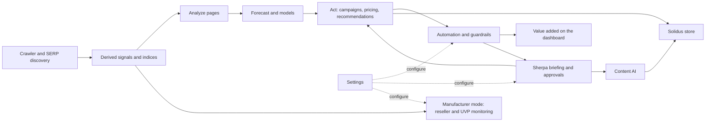

# GrowCentric Demo: The Complete Feature Guide

> Everything in the demo, what it shows, and how it all connects.
> App: Rails 7.1 · PostgreSQL · Tailwind CSS v4 · bilingual EN/DE · no auth, seeded data only.
> Live at https://growcentric-demo.ngrok.app (local: `bin/dev`, port 3000).

---

## 1. What this is

A product teaser for **GrowCentric.ai**, built for screenshots and demo videos. It renders the
product described in `PRODUCT_DESCRIPTION.md` (crawl → analyze → act, EU/GDPR-first, derived
signals instead of stored competitor prices) as a fully navigable, bilingual SaaS application.
Nothing calls external services; every page is rendered from seeded PostgreSQL data plus a few
curated literals, so the demo works offline and resets with one command.

Two important behaviours for recording:

- **Re-seed before recording**: `bin/rails db:seed`. The forecast, briefing and value-add data are
  generated relative to the current date, so re-seeding keeps "Today" markers and "x hours ago"
  labels fresh.
- **Language**: the flag button in the top bar toggles EN ↔ DE for the entire app, including all
  seeded content. Locale persists in the session; `?locale=de` works on any URL.

---

## 2. The demo cast

| Who | Role |
|---|---|
| **Velora Cycling Supply** | The merchant persona. Fictional Vienna shop on Solidus, `velora.keferboeck.com`, 16 products, 7 brands, 6 categories in 3 departments. |
| **LumenRide GmbH** | The manufacturer persona (maker of the three light SKUs). Used by Manufacturer mode, where Velora and the competitors reappear as *resellers*. |
| **Radquartier, Bikeinsel, Velodrom24, Pedalwerk, Alpenrad Shop, Gravelheld, Lichtblick Velo** | Invented competitors (and, in manufacturer mode, resellers). Lichtblick is the antagonist. |
| **pricehit24** | Unauthorized gray-market eBay seller (manufacturer mode only). |
| **Georg (Owner), Lena Moser (Admin), Tobias Brandt (Analyst)** | The team, used by settings, the content approval chain and the queue. |
| **Sherpa** | The AI copilot. Runs "on GrowCentric's own EU-hosted model"; powers the briefing, drafts, advisories and Content AI. |

---

## 3. One story, told from every angle

The demo is not a collection of screens; it is a single coherent market event visible everywhere.
The core thread:

1. **Lichtblick Velo undercuts the Beacon 1200 by 18%** and sponsors the same queries on
   Google Shopping, Meta and TikTok, plus a front+rear light bundle that beats Beacon + Pulse by €38.
2. That causes: a **critical alert**, a **losing price position**, a **category decline forecast**,
   a **pull-back recommendation**, two **repricing decisions** (one auto, one pending at €99,90),
   a **staged counter-bundle** in Sherpa's briefing, **heat 94** with a 6-hour response time, and,
   seen from LumenRide's side, a **UVP violation with a running notice escalation**.
3. Meanwhile the engine funds the response: the unprofitable Lights budget (3,8× ROAS but 0,76×
   POAS) shifts €1.800 to Bikepacking, hidden gems get their first campaigns, and the **value-added
   wedge** on the dashboard grows to +€30,9K, explained step by step on the Growth story page.

Secondary threads: TrailForge bikepacking as the under-promoted winner (hidden gems → budget shift →
campaign → "you own this niche" heat reading), the Orbit Wheel Lights opportunity (viewed and bought
but not advertised → TikTok test → pending price increase), Radquartier's recurring August sale
(season sales → Sherpa counter-plan draft), and the Vista Commuter "not on your radar" heat spike.

---

## 4. Pages

### 4.1 Dashboard (`/`)

The management view. Top to bottom:

- **Value added by GrowCentric** (gradient hero card): hero figure **+€30,9K**, +6,9% over the
  modelled baseline since the engine went live 70 days ago; itemised contributions (repricing
  engine, budget reallocation, hidden-gem campaigns, avoided decline); the **wedge chart** (actual
  vs baseline, shaded difference = value added) with crosshair tooltips; link **"How this
  happened →"** to the Growth story.
- **Stat tiles**: revenue last 30 days (with sparkline), forecast next 30 days, hidden gems count,
  competitors tracked.
- **Product portfolio matrix**: every product as a bubble; x = price position vs market minimum,
  y = visibility (share of voice), size = 30-day revenue, colour = sales trend. Labelled quadrants
  (Winners / Defend / Promote / Fix or exit), hover tooltips per bubble, link to the price table.
- **Revenue & forecast** mini chart (actuals + forecast + confidence band), **Latest signals**
  (alerts feed), **Top recommendations**, **Hidden gems** teaser card.

### 4.2 Growth story (`/value-story`)

The annotated explanation of the dashboard hero, linked from it. Centred layout, four summary
tiles (total value, current run-rate +€1.490/week, best single action, "Backfired: 1/9, caught by
guardrails in 6 days"). The **daily** revenue curve vs baseline carries:

- **9 numbered, colour-coded intervention markers** (click → scrolls to the matching event card
  and flashes it; hover → title tooltip). Types: milestone, repricing, A/B test, setback,
  correction, budget, campaign.
- **14 small gray dots** for minor auto-actions that never needed review.
- A step-by-step timeline of the nine events with dates, weekly € effects and links into the
  relevant pages. The centrepiece is the honest arc: event 4 (tROAS bid test backfires, −€240/week)
  → event 5 (POAS-floor guardrail auto-rollback after 6 days; the freed budget seeds event 6, the
  €1.800 Bikepacking shift, the biggest single win at +€430/week).
- Closing management takeaway: many small reversible moves, not one hero decision.

### 4.3 Sherpa (`/sherpa`) · Beta

The AI copilot page:

- **Privacy banner**: "Private by design", Sherpa runs on GrowCentric's own open-weights,
  commerce-fine-tuned, EU-hosted model; nothing goes to third-party AI clouds; no training on shop
  data. Mirrored in the composer footnote.
- **Chat** (demo conversation): "Why is Lights & Electronics heading into decline?" answered with
  the three stacked causes and quantified corrective plan, source chips linking to Forecast /
  Competitors / Campaigns; "If I could only do one thing today?" answered with the Beacon €99,90
  approval (+€2.300/month), including why it was held for review. Composer with suggestion chips
  (including "Which price wars are worth fighting?") that fill the input.
- **Morning briefing** (dated today, 07:00): live counts from the database (overnight competitor
  moves, auto-repriced SKUs, pending decisions and budget shifts), the **heat check** discovery
  (Vista Commuter at 72 while your price sat still), and a **staged auto-reaction**: the prepared
  Beacon+Pulse counter-bundle at €289 waiting for approval because auto-react is off, with buttons
  and a link to the automation settings.
- **Price-war advisories** (from competitive heat): **Engage** (Beacon, heat 94), **Stay out**
  (Gravel Tyre, heat 88, Velodrom24 matches in 4 h), **Take a look** (Vista Commuter, not on your
  radar), linking to the heat analysis.
- **Drafts waiting for you**: TikTok hooks for Orbit, the counter-plan for Radquartier's predicted
  August sale, and a supplier renegotiation email for LumenRide purchase prices (the root cause of
  the lights margin problem).
- "What Sherpa can do" card with the beta honesty note.

### 4.4 Content AI (nav group, Beta) · Solidus only

Sherpa writes and maintains store content in the shop's voice. Three pages plus a settings section:

- **Catalog content** (`/content`): every product as a row with language dots (DE/EN), description
  status derived from live demo data (Up to date / **Draft ready** where pricing decisions are
  pending / **Outdated: price changed** / **EN translation missing**), SEO meta status (incl. an
  A/B test), last updated, and state-matched action buttons (Review draft, Generate update,
  Translate, Regenerate, View in store). The full product filter bar works here. Stat tiles and a
  link to Brand voice settings.
- **Queue & approvals** (`/content/queue`): the chain Draft (Sherpa) → QA (Lena) → Approval
  (Georg), grouped by who is blocked: *Waiting for you* (Beacon copy update with Approve & publish
  / View diff / Request changes and a diff summary), *In QA with Lena* (Nudge Lena), *Drafts*
  (Review / Send to test / Discard), *Recently published* (auto-published items with Revert).
  Footer: 31 pieces this month, 0 typos shipped, everything versioned in Solidus.
- **Experiments** (`/content/experiments`): content A/B and multivariate tests as cards with
  variant tiles (leader highlighted), metric values, significance meters against the 95% line and
  actions; plus the dark **SEO & AIO** card (keywords tracked, schema coverage, AI citations per
  month; "when someone asks their assistant for the best bike light under €120, Velora is the shop
  it quotes").

### 4.5 Analyze

- **Hidden potential** (`/hidden-potential`): products ranked by potential score with score meters,
  status badges (Hidden gem / Bestseller / Losing ground / Steady), revenue vs ad spend, trends.
  **Filter bar** (department, category, brand, price tier, season) drives everything on the page;
  filtered URLs are shareable. **Rollup cards** by department, category and brand with revenue
  share bars, average potential and hidden-gem counts.
- **Competitors** (`/competitors`): discovered competitors (sponsored vs organic, discovery source
  and level, overlap, threat meter, pinning), the live signal feed (derived relative-value signals;
  "competitor prices are never stored"), and the **Crawl index**: per competitor the SKUs indexed,
  freshness, a **price-index dot on a parity scale** (your average price ÷ theirs; green at or
  below parity, red past 8%), plus columns for quantity discounts, subscription programmes and
  active sales (including Radquartier's *predicted* August sale). GDPR-by-architecture note.
- **Price position** (`/price-position`): the "are you the cheapest, and does it matter?" page.
  Filterable. Verdicts weigh price against visibility: Cheapest / **Cheapest, invisible** /
  **Premium holds** / Losing on price / Watch. The **"Viewed and bought, but not advertised"**
  callout (Orbit et al.). The **Competitive heat** panel: heat score 0–100 per product from
  price-change frequency, active competitors and **response speed to your moves** ("median 6 h"
  = their bestseller; "no reaction in 90 days" = you own the niche), with category heat chips and
  readings; the **Response timeline** card for the Beacon (your steps, who followed, how fast,
  "Heat 94"). Finally **"Who advertises where"**: the ad-presence matrix (You + competitors per
  product across Google Shopping / Meta / TikTok).
- **Delivery & offers** (`/delivery`): your Solidus shipping tariff next to **auto-captured
  competitor tariffs** in every structure (flat, free-shipping threshold, postcode zone, radius,
  weight tiers, size surcharge); **"Where shipping flips the comparison"** landed-price examples;
  competitor **subscription programmes** (Radquartier PLUS, B-Club), **quantity offers** (tyre
  bundle, light set) and **clearance offers**, each with a dynamics note; **season sales** history
  with one prediction derived from recurring patterns.
- **Forecast** (`/forecast`): daily actuals + 60-day forecast with confidence band, today marker
  and crosshair tooltips; early-warning banner (category decline) linking to corrective actions;
  weekly breakdown table; and **Forecasting models**: champion/challenger comparison (Ensemble v3,
  gradient boosting, SARIMA, Holt-Winters baseline) with backtest MAPE 30/90d and band coverage,
  auto-selection rules and the takeover condition.

### 4.6 Act

- **Campaigns** (`/campaigns`): every campaign with budget/spend meter, margin, ROAS and **POAS**
  (ROAS × gross margin), with the classic trap highlighted (3,8× ROAS but 0,76× POAS). The
  **budget reallocation engine**: shifts with the four factor chips (margin × conversion ×
  inventory × competitive), projected POAS gain, auto-applied vs suggested. **A/B tests** with
  variants, uplift, significance meter (95% marker) and auto-applied winners. **Channels &
  tracking**: automatic UTM convention, online channels plus **offline channels with QR codes**
  (scan counts, download), and the note that QR scans land in the same attribution so POAS
  includes print and events.
- **Dynamic pricing** (`/dynamic-pricing`): the implementation of the "Dynamic Pricing &
  Algorithmic Marketing" playbook. KPI tiles (SKUs enrolled, competitive win rate, gross margin
  trend, price changes with auto/held split). **Price development chart** for the Beacon: list
  price steps vs average sold price from the Solidus order stream, with a separate
  **market-min index strip** (derived index, raw prices never stored) and tooltips. **Prices
  actually sold at** by channel / campaign / customer segment (returning visitors buy €5,50 below
  list via the second-visit voucher). **Guardrails** (cost+25% floor, KVI ceilings ±2%, max ±5%/day,
  ,90 rounding, 30% elasticity blend, audit). **The hourly loop** (sync signals → recalc → feed
  sync → budget reallocation → log). **Elasticity optima** table using P* = (C × ε)/(ε + 1).
  **Decision log**: every reprice with old→new, trigger, strategy, guardrail, auto vs pending.
- **Recommendations** (`/recommendations`): the projected total impact hero, then sections
  Invest / Pull back / Corrective / Needs attention, each card with target, monthly € impact,
  confidence meter and Apply/Dismiss.

### 4.7 Manufacturer mode

- **Resellers** (`/resellers`): the same engine viewed as **LumenRide GmbH**. Stat tiles
  (resellers tracked, UVP compliance with trend, active violations, distribution coverage).
  **Your products in the market**: UVP, alert threshold, lowest advertised price and by whom,
  resellers stocking, status. **Reseller list**: authorized/unauthorized, own shop vs marketplace,
  SKUs, deviation vs UVP, status (Compliant / Recovered / Watch / Violation / Unauthorized) with
  context lines and actions (Send notice now, Request takedown, View offers). The antagonist
  reappears: Lichtblick's −18% is here a **UVP violation in escalation** (notice 1 opened, notice 2
  scheduled); Bikeinsel shows the success case (recovered 26 h after notice 1); **pricehit24** is
  the gray-market discovery with an eBay VeRO takedown running. **Notices sent** log and a "why
  manufacturers use this" card. Configured in Settings → Reseller policy.

---

## 5. Settings (`/settings/...`)

Nine sections behind a settings sub-navigation; the pages they govern link back to them.

| Section | Contents |
|---|---|
| **Automation & thresholds** (`automation`) | The autonomy toggles: auto-apply price changes, budget shifts, A/B winners; auto-react to competitor moves (off, which is why the briefing stages reactions for approval). Thresholds: max ±5% price change/day, 25% margin floor, €500 budget-shift cap, 95% A/B significance, 10% competitor-move relevance. KVI note. |
| **Notifications & briefing** (`notifications`) | Briefing on/off, delivery time and channels, include competitor movement and staged auto-reactions; alert rules (critical immediately, forecast early warnings, per-change notifications off by design). |
| **Integrations & crawler** (`integrations`) | Connected services (Solidus, Google Ads, Merchant Center, Meta, TikTok, Slack, Apify). Crawler: cadence, always-on robots.txt switch, the **GDPR-by-architecture** callout, index retention, crawl-credit usage with a purchase link. |
| **API & products** (`api`) | Solidus API config: store URL, API v2, masked token with rotate, webhook secret, **granted scopes** incl. `write:content` (Beta), status line and test button. **Synced products**: the real 16 products from the DB with SKU, price, last sync, status. |
| **Content & brand voice** (`content`) | **Brand voice per language** with linguistically correct formality (German: du/Sie; English: register Conversational/Formal), tone chips, language-guide files, **tone sources** (uploaded sample texts + the 214-page shop crawl) with Add samples / Re-crawl buttons, and learned traits. **What Sherpa maintains** as per-type auto-publish toggles. **Approval workflow** chain with auto-accept toggles. |
| **Reseller policy (UVP)** (`manufacturer`) | Manufacturer mode toggle (LumenRide), auto-discovery of resellers, **per-product UVP and threshold inputs** with computed floors, automatic notice rules (notice 1 after 24 h, escalation after 72 h, management escalation off → lands in the briefing, unauthorized-seller alerts), template picker (written by Sherpa in the brand voice, per reseller language), and the EU legal note on UVP vs binding resale prices. |
| **Team & permissions** (`team`) | Members with roles (Owner/Admin/Analyst/Viewer), role dropdowns, remove, pending invite with resend, and the role capability matrix. |
| **Plan & billing** (`billing`) | Growth plan card, usage meters, **Crawl credits**: definition, two-tone usage bar (plan + top-up), depletion projection, **pay-as-you-go packs** (500/€19, 2.000/€59, 10.000/€199) with auto-top-up toggle, **plan tiers** where the crawl allowance is the headline differentiator (Starter 250 / Growth 1.000 / Scale 5.000 per month), payment method, invoices. |
| **Your profile** (`profile`) | Name, email, language, timezone; security (password, 2FA required for approvals above €50 impact, active sessions). |

---

## 6. Global chrome

- **Sidebar**: logo (the real GrowCentric gradient seedling mark, vendored inline) + groups:
  Dashboard, Sherpa (Beta) · Analyze · Act · **Content AI** · **Manufacturer mode** · Settings ·
  Help (Manual, Join Slack, external-link styled) · the Velora shop card with crawler status.
- **Top bar, left**: **shop connection status** pill (pulsing green dot, `velora.keferboeck.com`,
  Solidus · connected) opening a health popover: API latency, last sync with counts, price push,
  webhooks, crawler, feed sync, uptime, Sync now / Manage.
- **Top bar, right**: **date range picker** (preset rows with resolved dates, compare-to section
  with previous period / same period last year, custom range behind a hairline; selections update
  the pill live) · notification bell · **language toggle** (keferboeck.com style: one circular
  button with the current language's circle-clipped flag; one click switches EN ↔ DE) · **user
  menu** (profile, plan & billing, team, sign out).
- All popovers share the same interaction contract: outside click and Escape close them.
- **Login wall (Devise)**: the whole app sits behind `/login` (classic centered card: logo,
  email + password, remember me, decorative "Continue with Google", brand-glow background).
  Password reset works end to end (`/password/reset`, mail delivery is `:test` in dev, the
  emailed link opens the styled "choose a new password" screen). `/register` is deliberately
  not a signup form: a gradient-bordered private-beta card explains that only invited and
  selected eCommerce shops have access and points to georg@growcentric.ai for test-phase
  requests. Auth screens share the `auth` layout, both languages, du-Form Devise messages
  via `config/locales/devise.de.yml`. Demo user: georg@keferboeck.com (seeded, password via
  `GROWCENTRIC_DEMO_PASSWORD` or the seed default). Sign out lives in the user menu.

---

## 7. Cross-feature threads (the connective tissue)

| Event in the data | Where it surfaces |
|---|---|
| Lichtblick −18% on Beacon 1200 | Critical alert (dashboard, forecast trigger) · losing verdict + heat 94 + response timeline (price position) · signal feed + crawl index promo flag (competitors) · pull-back recommendation · repricing decisions incl. pending €99,90 (dynamic pricing) · chat answer + staged counter-bundle (Sherpa) · **UVP violation in escalation** (resellers) · Beacon copy update in the content queue |
| Lights core: 3,8× ROAS but 0,76× POAS | Campaigns table footer trap · budget shift source · Sherpa chat cause #3 · growth story events 4–6 · supplier email draft (root cause: 20% purchase margin) |
| €1.800 shift Lights → Bikepacking | Budget engine (auto-applied) · growth story event 6 (+€430/week) · TrailForge invest recommendation · "you own this niche" heat reading |
| Orbit Wheel Lights | Hidden gem #2 · "viewed and bought, not advertised" callout · TikTok test campaign + A/B hook test · pending price increase to €35,90 (elasticity optimum) · content refresh auto-published · zero heat = safe to push |
| Radquartier's recurring August sale | Season sales history + prediction (delivery) · crawl index "expected mid-August" · Sherpa counter-plan draft · Vista Commuter heat spike context |
| Guardrails & thresholds (settings) | Explain the pending states everywhere: the €99,90 reprice waits (±5%/day), the counter-bundle waits (auto-react off), shifts above €500 wait, A/B winners below 95% keep running, content routes through the approval chain |
| The crawler | Competitors crawl index · delivery tariff capture · shop-status popover · integrations settings · crawl credits & plan tiers (billing) · reseller discovery (manufacturer) · content tone crawl (214 pages) |

---

## 8. Technical notes

**Schema** (all demo-scoped): `brands`, `departments`, `categories`, `products` (with economics:
cost, views, weeks of stock, visibility, market deltas, elasticity, season, dynamic-pricing flag),
`competitors`, `competitive_signals`, `recommendations`, `forecast_points`, `alerts`,
`shipping_rules`, `competitor_offers`, `sale_events`, `campaigns`, `budget_shifts`, `ab_tests`,
`channel_presences`, `price_points`, `sold_price_breakdowns`, `pricing_decisions`,
`value_add_points`. Everything seeds from `db/seeds.rb` (idempotent, date-relative,
deterministic RNG).

**i18n**: gettext-style. English strings in the views are the source; `dt()`
(`app/helpers/translation_helper.rb`) looks them up in `app/helpers/german_dictionary.rb`
(over 1,000 entries) with `%{name}` interpolation and English fallback, so a missing entry can never
break a page. Dates and time-ago come from `rails-i18n`. German uses the du-form. Locale is
session-persisted via `?locale=`.

**Charts**: server-rendered inline SVG (`app/helpers/chart_helper.rb` + per-view code), following
a consistent spec: 2px lines, ~10–15% opacity band fills, hairline solid gridlines, 4px end
markers with white rings, direct end labels in text colours, legends for multi-series charts,
vanilla-JS crosshair/marker tooltips, and never two scales on one axis (the price chart splits the
€ series and the market index into separate charts).

**Design system**: brand palette from the landing project (`#fff1be → #ee87cb → #b060ff`) as
Tailwind theme tokens (`brand-*`, derived `accent-*` purple scale, `.bg-brand-gradient`) in
`app/assets/tailwind/application.css`; the real logo mark vendored in `shared/_mark.html.erb`;
circle-clipped flags in `shared/_flag.html.erb`; Tailwind Plus application-UI patterns throughout.
Status colours (emerald/amber/rose/sky) are reserved for state and never used as series colours.

**House rules**: no em dashes anywhere (user rule; ranges may use en dashes); European number and
currency formatting (€1.234,56); all invented company names and domains; competitor product prices
are only ever shown as derived indices or deltas, consistent with the product's legal model
(reseller prices of the manufacturer's own products are the deliberate exception).

---

## 9. URL index

| Path | Page |
|---|---|
| `/` | Dashboard |
| `/value-story` | Growth story (annotated value chart) |
| `/sherpa` | Sherpa AI copilot (Beta) |
| `/content` | Content AI: catalog content |
| `/content/queue` | Content AI: queue & approvals |
| `/content/experiments` | Content AI: experiments |
| `/hidden-potential` | Hidden potential |
| `/competitors` | Competitors + crawl index |
| `/price-position` | Price position, heat, ad presence |
| `/delivery` | Delivery & offers intelligence |
| `/forecast` | Forecast + model comparison |
| `/campaigns` | Campaigns, budget engine, A/B, channels & tracking |
| `/dynamic-pricing` | Dynamic pricing engine |
| `/recommendations` | Recommendations |
| `/resellers` | Manufacturer mode: reseller monitoring |
| `/settings/automation` | Automation & thresholds |
| `/settings/notifications` | Notifications & briefing |
| `/settings/integrations` | Integrations & crawler |
| `/settings/api` | API & products |
| `/settings/content` | Content & brand voice |
| `/settings/manufacturer` | Reseller policy (UVP) |
| `/settings/team` | Team & permissions |
| `/settings/billing` | Plan & billing (crawl credits, tiers, top-ups) |
| `/settings/profile` | Your profile |
| `/login` | Sign in (Devise) |
| `/password/reset` | Password reset request |
| `/register` | Private-beta access request (no self-signup) |

Any URL accepts `?locale=en` / `?locale=de`; filters on the product pages are plain GET
parameters, so filtered views are linkable too.
